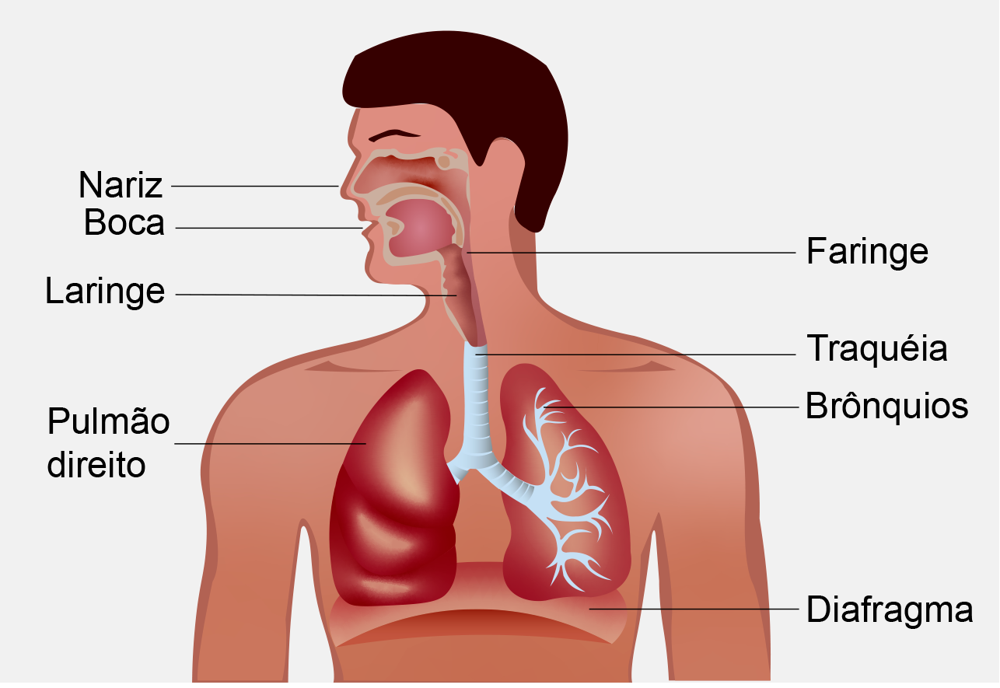

## Projeto RevELA - Cuidadores na Assistência ao Paciente – Cuidados respiratórios na ELA 

#### Informações úteis para distribuição

O Conteúdo que está no diretório **dist** vai ser compartilhado. O que está no **src** é usado apenas para desenvolvimento

Repositório [https://github.com/elionaimelo/projetoRevELAv1](https://github.com/elionaimelo/projetoRevELAv1).




É preciso instalar algumas depedências(caso não tenha instalado)

node [https://nodejs.org/download](https://nodejs.org/download/).

gulp [https://gulpjs.com/](https://gulpjs.com/)

Para instalar o gulp, execute o seguinte comando:
```
npm install --global gulp-cli
```

depois execute o comando para instalar todas as outras dependências do projeto
```
npm i
```

#### Informações úteis para o desenvolvimento

Todos os scripts serão concatenados e minificados, portanto, é importante saber das informações abaixo

* Para inserir arquivos baixados com o gerenciador de pacotes acesse o **gulpfile.js** e a função **copyAssets**

* Para ordernar o script acesse o **gulpfile.js** e procure pela função **javascript**

#### Alguns comandos para o projeto

+  `gulp` - recompila e minifica tudo e coloca dentro do diretório `dist`. Além de iniciar uma servidor local com browserupdate

+  `gulp build` - recompila e minifica tudo e coloca dentro do diretório `dist`

